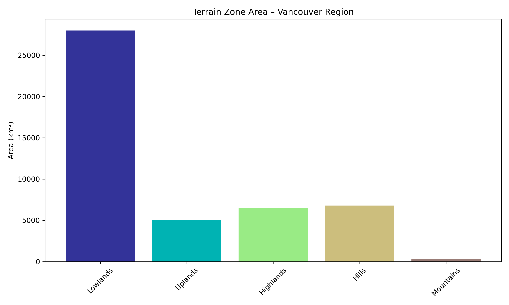

# Vancouver-terrain-mapping
A Python-based geospatial analysis that merges elevation GeoTIFF tiles, classifies terrain into elevation zones, and visualizes the Vancouver region’s terrain using color-coded maps and bar charts. Includes CRS handling and hillshade effects.
---

## Visualizations

### Terrain Zones Map


The map shows terrain classified into zones like Lowlands, Uplands, Highlands, Hills, Mountains, and High Mountains with a hillshade overlay for 3D effect.

---

### Terrain Zone Areas



Bar chart displaying the area (in km²) covered by each terrain zone in the Vancouver region.

```bash
